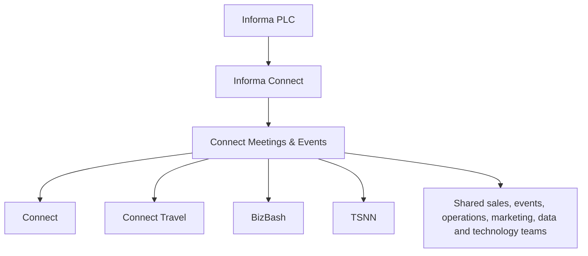

## Reporting and operating structure

The four brands share the `connect-prod` Salesforce org and a common operating organisation. Brand is therefore not a reliable single-field partition in reporting.

## How to navigate the organisation

| Need | Use |
| --- | --- |
| Understand business areas | [Departments](/people/departments) |
| Route a decision or exception | [Who owns what](/people/who-owns-what) |
| Understand reporting lines | [Organisation chart](/people/org-chart) |
| Find a staff contact | [Staff directory](/people/directory) |
| Split commercial data by brand | `OpportunityLineItem.Organization__c`, documented on [Brands](/company/brands) |

<Warning>
  Ownership and reporting are different. Use **Who owns what** for decisions and the **Organisation chart** for management lines. Do not infer one from the other.
</Warning>
