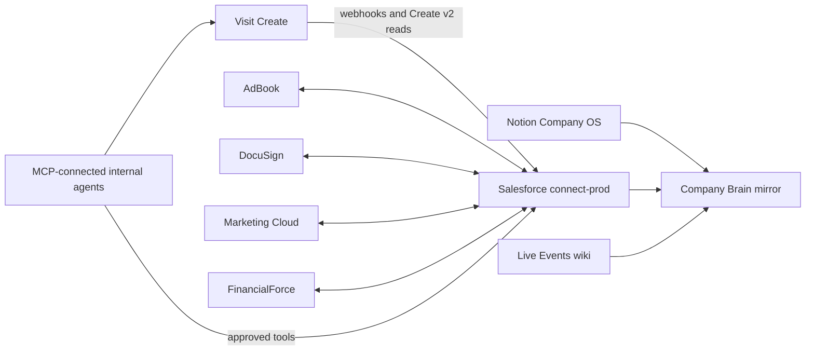

Use this section to identify the owning system, interface, and detailed reference before diagnosing or changing an integration.

<Columns cols={2}>
  <Card title="Salesforce integrations" icon="cloud" href="/operations/integrations/salesforce-integrations">
    Managed packages, field prefixes, billing boundaries, and technical debt.
  </Card>
  <Card title="API catalogue" icon="code" href="/operations/integrations/api-catalogue">
    The documented APIs and where their exact contracts live.
  </Card>
  <Card title="Webhooks" icon="webhook" href="/operations/integrations/webhooks">
    The five Visit Create inbound pipelines and their recovery path.
  </Card>
  <Card title="Automation catalogue" icon="workflow" href="/operations/integrations/automation-catalogue">
    Documented automations, candidates, owners, and verification status.
  </Card>
</Columns>

<Warning>
  Do not place credentials, signing tokens, bearer tokens, visitor records, or webhook URLs containing secrets on this site.
</Warning>
